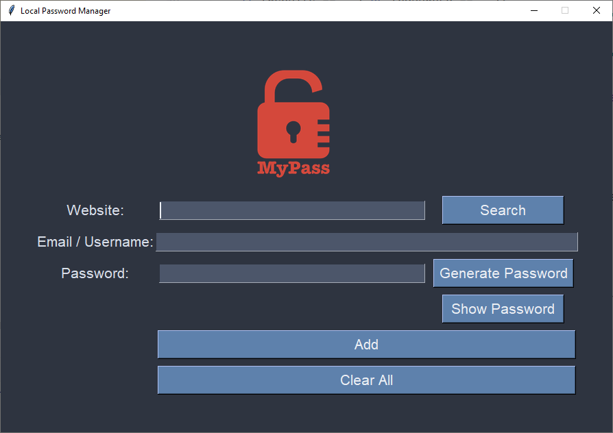

# 🔐 Password Manager

A simple and secure local password manager built with Python and Tkinter. This application allows you to generate strong passwords, save them locally, and retrieve them when needed. It also includes features like password visibility toggling, email validation, and a search functionality to find saved passwords.



---

## ✨ Features

- **🔑 Password Generation**: Generate strong, random passwords with a mix of letters, numbers, and symbols.
- **💾 Save Passwords**: Store website, email, and password details locally in a text file.
- **🔍 Search Passwords**: Retrieve saved passwords by searching for the website name.
- **👁️ Toggle Password Visibility**: Show or hide the password for better usability.
- **📧 Email Validation**: Ensure the email entered is in a valid format before saving.
- **🧹 Clear All Fields**: Clear all input fields with a single click.
- **📋 Copy to Clipboard**: Automatically copy generated passwords to the clipboard.

---

## 🚀 Installation

1. **Clone the repository**:
   ```bash
   git clone https://github.com/masood2004/password_manager.git
   cd password_manager
   ```

2. **Install dependencies**:
   - Ensure you have Python 3.x installed.
   - Install the required Python packages:
     ```bash
     pip install pyperclip
     ```

3. **Run the application**:
   ```bash
   python main.py
   ```

---

## 🎮 Usage

1. **Add a new password**:
   - Enter the website, email/username, and password (or generate one using the "Generate Password" button).
   - Click "Add" to save the details.

2. **Generate a password**:
   - Click the "Generate Password" button to create a strong, random password.

3. **Search for a password**:
   - Enter the website name and click "Search" to retrieve the saved email and password.

4. **Toggle password visibility**:
   - Click the "Show Password" button to toggle the visibility of the password.

5. **Clear all fields**:
   - Click the "Clear All" button to clear all input fields.

---

## 📂 File Structure

```
password_manager/
├── main.py                # Main application script
├── passwords.txt          # File where passwords are stored
├── images/                # Folder containing images (e.g., logo)
│   └── logo.png           # Application logo
├── README.md              # Project documentation
└── requirements.txt       # List of dependencies
```

---

## 🤝 Contributing

Contributions are welcome! If you'd like to contribute, please follow these steps:

1. Fork the repository.
2. Create a new branch (`git checkout -b feature/YourFeatureName`).
3. Commit your changes (`git commit -m 'Add some feature'`).
4. Push to the branch (`git push origin feature/YourFeatureName`).
5. Open a pull request.

---

## 📜 License

This project is licensed under the MIT License. See the [LICENSE](LICENSE) file for details.

---

## 🙏 Acknowledgments

- Built with [Python](https://www.python.org/) and [Tkinter](https://docs.python.org/3/library/tkinter.html).
- Inspired by the need for a simple, local password management solution.

---

Made with ❤️ by [Masood](https://github.com/masood2004). Feel free to reach out if you have any questions or suggestions!
